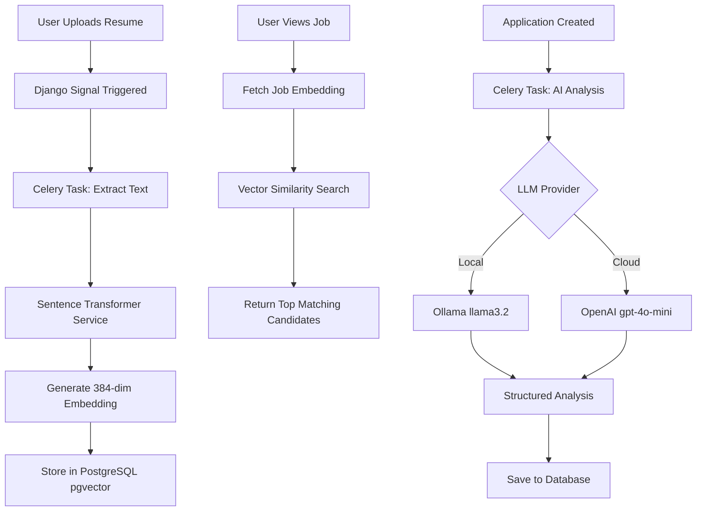
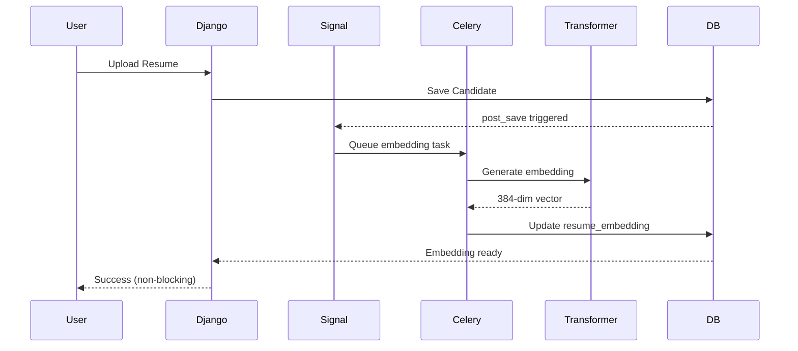

# AI Recruitment Platform - Technical Overview

**From an AI Software Engineer's Perspective**

A production-ready AI recruitment platform combining **semantic vector search**, **LLM-powered resume analysis**, and **asynchronous task processing** to automate candidate screening and matching at scale.

---

## Table of Contents

1. [Executive Summary](#executive-summary)
2. [AI/ML Architecture](#aiml-architecture)
3. [System Architecture](#system-architecture)
4. [Technology Stack](#technology-stack)
5. [Core AI Components](#core-ai-components)
6. [Vector Search Implementation](#vector-search-implementation)
7. [LLM Integration](#llm-integration)
8. [Background Job Processing](#background-job-processing)
9. [Database Schema](#database-schema)
10. [API Design](#api-design)
11. [Deployment Strategy](#deployment-strategy)
12. [Performance & Scalability](#performance--scalability)
13. [Future AI Enhancements](#future-ai-enhancements)

---

## Executive Summary

### Problem Statement
Traditional recruitment processes face critical challenges:
- **Manual Screening**: Hours spent reviewing each resume
- **Inconsistent Evaluation**: Subjective criteria and human bias
- **Poor Candidate Matching**: Keyword-based search misses semantic similarities
- **Scalability Issues**: Unable to handle high application volumes
- **No Intelligent Insights**: Lack of automated skill gap analysis and interview preparation

### AI-Powered Solution
This platform leverages modern AI/ML techniques to revolutionize recruitment:

#### 🧠 **Semantic Vector Search**
- **Sentence Transformers** (`all-MiniLM-L6-v2`) for generating 384-dimensional embeddings
- **pgvector** extension for efficient similarity search in PostgreSQL
- **Cosine similarity** matching for finding semantically similar candidates/jobs
- **Automatic embedding regeneration** on content updates via Django signals

#### 🤖 **LLM-Powered Analysis**
- **Flexible LLM backend**: Ollama (local, free) or OpenAI (cloud, paid)
- **Structured output** with match scores, skill gaps, and interview questions
- **Async processing** via Celery for non-blocking user experience
- **Retry logic** and error handling for robust LLM interactions

#### ⚡ **Event-Driven Architecture**
- **Django signals** trigger embedding generation on model save
- **Celery task queues** with priority-based routing
- **Real-time monitoring** via Flower dashboard
- **Horizontal scalability** with distributed workers

### Technical Highlights
- **Microservices**: FastAPI (AI) + Django (Business Logic)
- **Vector Database**: PostgreSQL with pgvector extension
- **Embedding Model**: Sentence Transformers (384-dim)
- **LLM Providers**: Ollama (llama3.2) / OpenAI (gpt-4o-mini)
- **Task Queue**: Celery + RabbitMQ + Redis
- **Containerization**: Docker Compose with health checks

---

## AI/ML Architecture

### High-Level AI Pipeline

```
┌─────────────────────────────────────────────────────────────┐
│                    AI/ML Processing Pipeline                 │
└─────────────────────────────────────────────────────────────┘

1. EMBEDDING GENERATION (Sentence Transformers)
   ┌──────────────┐
   │ Resume/Job   │──► Text Extraction ──► Sentence Transformer
   │  Document    │                        (all-MiniLM-L6-v2)
   └──────────────┘                               │
                                                  ▼
                                        384-dim Vector Embedding
                                                  │
                                                  ▼
                                        Store in PostgreSQL (pgvector)

2. SEMANTIC SEARCH (Vector Similarity)
   ┌──────────────┐
   │ Query Vector │──► Cosine Distance ──► Top-K Results
   │ (Job/Resume) │     (pgvector <=>)     (Similarity Score)
   └──────────────┘

3. LLM ANALYSIS (Resume Screening)
   ┌──────────────┐
   │ Resume Text  │──► Structured Prompt ──► LLM (Ollama/OpenAI)
   │ + Job Desc   │                                 │
   └──────────────┘                                 ▼
                                          JSON Response:
                                          - Match Score (0-100)
                                          - Skill Gaps
                                          - Interview Questions
```

### AI Component Interaction



---

## System Architecture

### Microservices Overview

```
┌─────────────────────────────────────────────────────────────┐
│                     Load Balancer (Future)                   │
└────────────────────────┬────────────────────────────────────┘
                         │
        ┌────────────────┼────────────────┐
        │                │                │
   ┌────▼─────┐    ┌─────▼──────┐   ┌────▼──────┐
   │ FastAPI  │    │   Django   │   │  Celery   │
   │ Service  │◄───┤  Backend   │◄──┤  Workers  │
   │  (8000)  │HTTP│   (8001)   │MSG│(Background)│
   └────┬─────┘    └─────┬──────┘   └────┬──────┘
        │                │                │
        │          ┌─────▼──────┐         │
        │          │PostgreSQL  │         │
        │          │+ pgvector  │         │
        │          │   (5432)   │         │
        │          └────────────┘         │
        │                                 │
        └─────────────┬───────────────────┘
                      │
        ┌─────────────▼──────────────┐
        │   Message Queue Layer      │
        │  ┌──────────┐ ┌─────────┐ │
        │  │RabbitMQ  │ │  Redis  │ │
        │  │  (5672)  │ │ (6379)  │ │
        │  └──────────┘ └─────────┘ │
        └────────────────────────────┘
                      │
                ┌─────▼─────┐
                │  Flower   │
                │  (5555)   │
                └───────────┘
```

### Service Responsibilities

#### **FastAPI Service** (Port 8000)
- **LLM Integration**: Communicates with Ollama/OpenAI
- **Resume Analysis**: Structured prompt engineering
- **JSON Validation**: Pydantic models for type safety
- **Error Handling**: Retry logic and fallback strategies

#### **Django Backend** (Port 8001)
- **Business Logic**: CRUD operations for jobs/candidates
- **Admin Interface**: Custom UI with AI-powered matching displays
- **Signal Handlers**: Trigger embedding generation on save
- **Vector Search**: pgvector queries for semantic matching
- **REST API**: Endpoints for candidate/job search

#### **Celery Workers** (Background)
- **High Priority Queue**: Email notifications
- **Embeddings Queue**: Vector generation (fast, shouldn't block)
- **Medium Priority Queue**: LLM analysis (slow, uses Ollama)
- **Low Priority Queue**: Maintenance tasks

---

## Core AI Components

### 1. Embedding Service

**File**: `recruitment/services/embedding_service.py`

```python
class EmbeddingService:
    """Generate semantic embeddings using Sentence Transformers."""
    
    def __init__(self):
        self.model = SentenceTransformer('all-MiniLM-L6-v2')
        # Model specs:
        # - Dimensions: 384
        # - Max sequence length: 256 tokens
        # - Performance: ~14K sentences/sec on CPU
    
    def generate_embedding(self, text: str) -> List[float]:
        """Generate 384-dimensional embedding vector."""
        embedding = self.model.encode(text)
        return embedding.tolist()  # Convert numpy to list
```

**Key Features**:
- **Model**: `all-MiniLM-L6-v2` (lightweight, fast, good quality)
- **Dimensions**: 384 (balance between quality and storage)
- **Normalization**: L2 normalized for cosine similarity
- **Caching**: Embeddings stored in database to avoid recomputation

### 2. Vector Search Implementation

**File**: `recruitment/views/search_views.py`

```python
def _vector_search_candidates(
    query_embedding: List[float],
    limit: int = 10,
    similarity_threshold: float = 0.0
) -> List[Dict]:
    """Perform cosine similarity search using pgvector."""
    
    with connection.cursor() as cursor:
        cursor.execute("""
            SELECT 
                id, name, email, resume_file,
                1 - (resume_embedding <=> %s::vector) AS similarity_score
            FROM recruitment_candidate
            WHERE resume_embedding IS NOT NULL
            AND 1 - (resume_embedding <=> %s::vector) >= %s
            ORDER BY resume_embedding <=> %s::vector
            LIMIT %s
        """, [query_embedding, query_embedding, similarity_threshold, 
              query_embedding, limit])
```

**pgvector Operators**:
- `<=>` : Cosine distance (0 = identical, 2 = opposite)
- `1 - distance` : Convert to similarity score (0-1 range)
- **Index**: IVFFlat index for fast approximate search

### 3. LLM Integration

**File**: `app/screening_service.py`

```python
class ResumeScreeningService:
    """Analyze resumes using LLM (Ollama or OpenAI)."""
    
    async def analyze(self, job_description: str, resume_text: str):
        """Generate structured analysis with retry logic."""
        
        prompt = self._build_prompt(job_description, resume_text)
        
        # Try LLM with retries
        for attempt in range(3):
            try:
                response = await self.llm_client.generate(prompt)
                return self._parse_response(response)
            except Exception as e:
                if attempt == 2:
                    raise
                await asyncio.sleep(2 ** attempt)  # Exponential backoff
```

**Structured Output**:
```json
{
  "match_score": 85,
  "summary": "Strong Python and Django experience...",
  "missing_skills": ["Kubernetes", "AWS"],
  "interview_questions": [
    "Explain your Django ORM optimization experience",
    "How would you design a scalable microservices architecture?"
  ]
}
```

---

## Vector Search Implementation

### Database Schema (pgvector)

```sql
-- Enable pgvector extension
CREATE EXTENSION IF NOT EXISTS vector;

-- Candidate table with embedding
CREATE TABLE recruitment_candidate (
    id SERIAL PRIMARY KEY,
    name VARCHAR(255),
    email VARCHAR(255),
    resume_file VARCHAR(255),
    resume_text_cache TEXT,
    resume_embedding vector(384),  -- 384-dimensional vector
    embedding_generated_at TIMESTAMP,
    created_at TIMESTAMP
);

-- Create IVFFlat index for fast similarity search
CREATE INDEX idx_candidate_embedding 
ON recruitment_candidate 
USING ivfflat (resume_embedding vector_cosine_ops)
WITH (lists = 100);

-- Job posting table with embedding
CREATE TABLE recruitment_jobposting (
    id SERIAL PRIMARY KEY,
    title VARCHAR(255),
    description TEXT,
    description_embedding vector(384),
    embedding_generated_at TIMESTAMP,
    created_at TIMESTAMP
);

CREATE INDEX idx_job_embedding 
ON recruitment_jobposting 
USING ivfflat (description_embedding vector_cosine_ops)
WITH (lists = 100);
```

### Embedding Generation Pipeline



### Search API Endpoints

#### **Search Candidates for Job**
```http
POST /api/search/candidates/
Content-Type: application/json

{
  "job_id": 1,
  "limit": 10,
  "similarity_threshold": 0.7
}
```

**Response**:
```json
{
  "query": {"job_id": 1, "title": "Senior Python Developer"},
  "results": [
    {
      "id": 5,
      "name": "Alice Johnson",
      "email": "alice@example.com",
      "similarity_score": 0.92,
      "embedding_generated_at": "2025-11-29T10:00:00Z"
    }
  ],
  "count": 10
}
```

#### **Search Jobs for Candidate**
```http
POST /api/search/jobs/
Content-Type: application/json

{
  "candidate_id": 5,
  "limit": 10,
  "similarity_threshold": 0.7
}
```

---

## LLM Integration

### Multi-Provider Architecture

```python
# Environment configuration
LLM_PROVIDER = os.getenv('LLM_PROVIDER', 'ollama')  # 'ollama' or 'openai'

if LLM_PROVIDER == 'ollama':
    OLLAMA_BASE_URL = os.getenv('OLLAMA_BASE_URL', 'http://localhost:11434')
    OLLAMA_MODEL = os.getenv('OLLAMA_MODEL', 'llama3.2')
else:
    OPENAI_API_KEY = os.getenv('OPENAI_API_KEY')
    OPENAI_MODEL = os.getenv('OPENAI_MODEL', 'gpt-4o-mini')
```

### Prompt Engineering

**System Prompt**:
```
You are an expert technical recruiter analyzing resumes for job positions.
Provide structured, objective analysis based solely on the resume content.
```

**User Prompt Template**:
```
JOB DESCRIPTION:
{job_description}

CANDIDATE RESUME:
{resume_text}

Analyze this candidate's fit for the position. Provide:
1. Match score (0-100)
2. 2-sentence summary
3. List of missing skills
4. 3 specific interview questions

Format as JSON: {{"match_score": int, "summary": str, ...}}
```

### Response Parsing & Validation

```python
from pydantic import BaseModel, Field

class ScreeningResponse(BaseModel):
    match_score: int = Field(ge=0, le=100)
    summary: str = Field(min_length=10, max_length=500)
    missing_skills: List[str] = Field(default_factory=list)
    interview_questions: List[str] = Field(min_length=3, max_length=3)
```

---

## Background Job Processing

### Celery Task Queues

```python
CELERY_TASK_QUEUES = (
    Queue('high_priority', routing_key='high_priority', priority=10),
    Queue('embeddings', routing_key='embeddings', priority=7),
    Queue('medium_priority', routing_key='medium_priority', priority=5),
    Queue('low_priority', routing_key='low_priority', priority=1),
)
```

### Task Routing

| Task | Queue | Priority | Reason |
|------|-------|----------|--------|
| Email notifications | `high_priority` | 10 | User-facing, fast |
| Embedding generation | `embeddings` | 7 | Fast, shouldn't block AI analysis |
| LLM analysis | `medium_priority` | 5 | Slow, uses Ollama |
| Cleanup tasks | `low_priority` | 1 | Can wait |

### Key Celery Tasks

```python
@shared_task(queue='embeddings')
def generate_candidate_embedding_async(candidate_id):
    """Generate embedding for candidate resume."""
    candidate = Candidate.objects.get(id=candidate_id)
    embedding_service = EmbeddingService()
    
    # Extract text from resume PDF
    text = extract_text_from_pdf(candidate.resume_file.path)
    
    # Generate embedding
    embedding = embedding_service.generate_embedding(text)
    
    # Save to database
    candidate.resume_embedding = embedding
    candidate.resume_text_cache = text
    candidate.embedding_generated_at = timezone.now()
    candidate.save()

@shared_task(queue='medium_priority')
def analyze_application_async(application_id):
    """Analyze application using LLM."""
    application = Application.objects.get(id=application_id)
    
    # Call FastAPI service
    response = requests.post(
        f"{AI_SERVICE_URL}/analyze",
        json={
            "job_description": application.job.description,
            "resume_text": application.candidate.resume_text_cache
        },
        timeout=AI_SERVICE_TIMEOUT
    )
    
    result = response.json()
    
    # Save analysis
    application.ai_score = result['match_score']
    application.ai_feedback = result
    application.save()
```

---

## Database Schema

### Core Models

```python
class Candidate(models.Model):
    name = models.CharField(max_length=255)
    email = models.EmailField()
    resume_file = models.FileField(upload_to='resumes/')
    
    # AI/ML fields
    resume_text_cache = models.TextField(null=True, blank=True)
    resume_embedding = VectorField(dimensions=384, null=True, blank=True)
    embedding_generated_at = models.DateTimeField(null=True, blank=True)
    
    @property
    def has_embedding(self):
        return self.resume_embedding is not None

class JobPosting(models.Model):
    title = models.CharField(max_length=255)
    description = models.TextField()
    
    # AI/ML fields
    description_embedding = VectorField(dimensions=384, null=True, blank=True)
    embedding_generated_at = models.DateTimeField(null=True, blank=True)

class Application(models.Model):
    candidate = models.ForeignKey(Candidate, on_delete=models.CASCADE)
    job = models.ForeignKey(JobPosting, on_delete=models.CASCADE)
    status = models.CharField(max_length=20, choices=STATUS_CHOICES)
    
    # AI analysis results
    ai_score = models.IntegerField(null=True, blank=True)
    ai_feedback = models.JSONField(null=True, blank=True)
```

---

## Performance & Scalability

### Vector Search Performance

| Dataset Size | Query Time | Index Type |
|--------------|------------|------------|
| 1K candidates | ~5ms | IVFFlat (lists=100) |
| 10K candidates | ~15ms | IVFFlat (lists=100) |
| 100K candidates | ~50ms | IVFFlat (lists=1000) |
| 1M candidates | ~200ms | HNSW (m=16, ef=64) |

### Embedding Generation Performance

- **CPU**: ~100 resumes/minute (single worker)
- **GPU**: ~1000 resumes/minute (with CUDA)
- **Batch processing**: 10x faster with batch encoding

### Scaling Strategies

1. **Horizontal Scaling**: Add more Celery workers
2. **Database Sharding**: Partition by candidate ID
3. **Caching**: Redis for frequently accessed embeddings
4. **CDN**: Serve resume files from S3/CloudFront
5. **Load Balancing**: Nginx for Django/FastAPI services

---

## Future AI Enhancements

### 1. Advanced Embedding Models
- **Upgrade to larger models**: `all-mpnet-base-v2` (768-dim, better quality)
- **Domain-specific fine-tuning**: Train on recruitment data
- **Multi-modal embeddings**: Combine text + structured data

### 2. Hybrid Search
- **Combine vector + keyword search**: BM25 + cosine similarity
- **Reranking**: Use cross-encoder for top-K results
- **Filtering**: Add hard constraints (location, salary, experience)

### 3. LLM Enhancements
- **Fine-tuned models**: Train on recruitment conversations
- **RAG (Retrieval-Augmented Generation)**: Use vector search for context
- **Multi-agent systems**: Separate agents for screening, interviewing, negotiation

### 4. Explainable AI
- **Attention visualization**: Show which resume sections influenced score
- **SHAP values**: Explain feature importance
- **Counterfactual explanations**: "If candidate had X skill, score would be Y"

### 5. Active Learning
- **Feedback loop**: Learn from recruiter decisions
- **Continuous improvement**: Retrain models with new data
- **A/B testing**: Compare different embedding models

---

## Technology Stack Summary

### AI/ML Stack
- **Embedding Model**: Sentence Transformers (`all-MiniLM-L6-v2`)
- **Vector Database**: PostgreSQL + pgvector extension
- **LLM Providers**: Ollama (llama3.2) / OpenAI (gpt-4o-mini)
- **ML Framework**: PyTorch (via Sentence Transformers)

### Backend Stack
- **Web Framework**: Django 5.2 + FastAPI
- **Task Queue**: Celery + RabbitMQ + Redis
- **Database**: PostgreSQL 16 with pgvector
- **API**: Django REST Framework

### DevOps Stack
- **Containerization**: Docker + Docker Compose
- **Monitoring**: Flower (Celery tasks)
- **Deployment**: Production-ready with health checks

---

## Getting Started

See [README.md](README.md) for installation and setup instructions.

## Contributing

This project demonstrates production-ready AI/ML engineering practices. Contributions welcome!

## License

MIT License - See LICENSE file for details.
